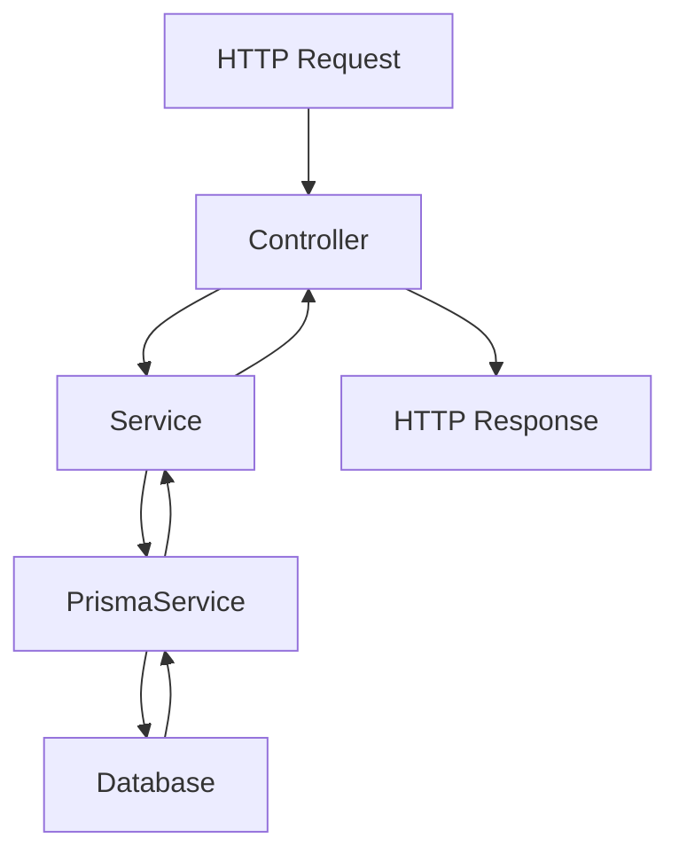
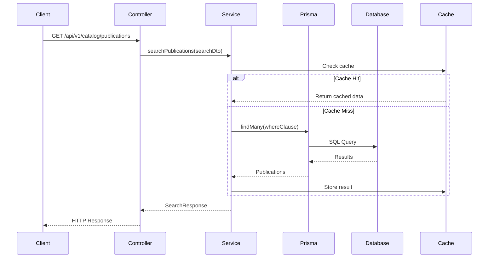

# Catalog Service - Arquitectura y Documentación

## 🏗️ **Arquitectura del Catalog Service**

### **Propósito Principal**
El `catalog-service` es un microservicio especializado en la gestión y búsqueda de publicaciones académicas. Actúa como un catálogo centralizado que indexa y permite consultar publicaciones científicas.

---

## 📁 **Estructura del Proyecto**

```
catalog-service/
├── src/
│   ├── controllers/          # Controladores REST API
│   ├── services/            # Lógica de negocio
│   ├── prisma/             # Configuración de base de datos
│   ├── dto/                # Data Transfer Objects
│   ├── interfaces/          # Interfaces TypeScript
│   ├── events/             # Eventos de comunicación
│   ├── filters/            # Filtros de excepciones
│   ├── interceptors/       # Interceptores
│   └── consul/             # Configuración de Consul
├── prisma/
│   └── schema.prisma       # Esquema de base de datos
└── .env                    # Variables de entorno
```

---

## 🗄️ **Base de Datos (CockroachDB)**

### **Modelos Principales:**

1. **`CatalogPublication`** - Publicaciones académicas
   ```typescript
   - id, originalId, title, abstract, keywords
   - type, primaryAuthor, coAuthors, metadata
   - publishedAt, isbn, doi, category, license
   - downloadUrl, status, viewCount, indexedAt
   ```

2. **`CatalogAuthor`** - Autores de publicaciones
   ```typescript
   - id, originalId, fullName, affiliation, orcid
   - publicationCount, lastPublishedAt
   ```

3. **`SearchStatistics`** - Estadísticas de búsqueda
   ```typescript
   - id, query, resultCount, executionTimeMs
   - filters, timestamp
   ```

---

## 🔧 **Servicios Principales**

### **1. CatalogService**
- **Función**: Gestión principal de publicaciones
- **Responsabilidades**:
  - Indexar nuevas publicaciones
  - Retirar publicaciones
  - Actualizar estadísticas de autores
  - Manejar eventos de publicación

### **2. CatalogSearchService**
- **Función**: Búsqueda avanzada de publicaciones
- **Características**:
  - Búsqueda por texto completo
  - Filtros por categoría, tipo, autor
  - Paginación y ordenamiento
  - Estadísticas de búsqueda

### **3. CatalogAuthorService**
- **Función**: Gestión de autores
- **Funcionalidades**:
  - CRUD de autores
  - Búsqueda de autores
  - Publicaciones por autor
  - Top autores

### **4. MetricsService**
- **Función**: Métricas y estadísticas
- **Métricas**:
  - Estadísticas de catálogo
  - Métricas de búsqueda
  - Rendimiento del servicio

---

## 🌐 **APIs REST**

### **Endpoints Principales:**

1. **`/api/v1/catalog/search`** - Búsqueda de publicaciones
2. **`/api/v1/catalog/publications/:id`** - Obtener publicación específica
3. **`/api/v1/catalog/authors`** - Listar autores
4. **`/api/v1/catalog/authors/:id`** - Obtener autor específico
5. **`/api/v1/catalog/authors/:id/publications`** - Publicaciones de un autor
6. **`/api/v1/health`** - Estado del servicio
7. **`/api/v1/metrics`** - Métricas del servicio

---

## 📡 **Comunicación con Otros Servicios**

### **Eventos que Escucha:**
```typescript
- PublicationPublishedEvent    // Nueva publicación
- PublicationWithdrawnEvent   // Publicación retirada
- AuthorCreatedEvent          // Nuevo autor
- AuthorUpdatedEvent          // Autor actualizado
```

### **Eventos que Emite:**
```typescript
- PublicationIndexedEvent     // Publicación indexada
- SearchPerformedEvent        // Búsqueda realizada
```

---

## 🛠️ **Tecnologías y Dependencias**

### **Core:**
- **NestJS** - Framework principal
- **TypeScript** - Lenguaje de programación
- **Prisma** - ORM para base de datos

### **Base de Datos:**
- **CockroachDB** - Base de datos distribuida

### **Comunicación:**
- **RabbitMQ** - Message broker (temporalmente deshabilitado)
- **Consul** - Service discovery

### **Caché:**
- **Cache Manager** - Caché en memoria

### **Monitoreo:**
- **Swagger** - Documentación API
- **Throttler** - Rate limiting

---

## 🔍 **Flujo de Datos**

### **1. Indexación de Publicaciones:**
```
Publication Service → Event → Catalog Service → Database
```

### **2. Búsqueda de Publicaciones:**
```
Client Request → Catalog Service → Database → Cached Response
```

### **3. Gestión de Autores:**
```
Auth Service → Event → Catalog Service → Update Author Stats
```

---

## 📊 **Características Especiales**

### **Caché Inteligente:**
- Caché automático de búsquedas frecuentes
- TTL configurable por endpoint
- Invalidación automática

### **Búsqueda Avanzada:**
- Búsqueda por texto completo
- Filtros múltiples
- Ordenamiento personalizable
- Paginación eficiente

### **Métricas Detalladas:**
- Tiempo de respuesta
- Estadísticas de uso
- Rendimiento de búsquedas

---

## 🚀 **Estado Actual**

### **✅ Funcionando:**
- Estructura del proyecto
- Configuración de Prisma
- Modelos de base de datos
- APIs REST básicas

### **⚠️ En Desarrollo:**
- Registro con Consul
- Comunicación con RabbitMQ
- Caché global
- Health checks completos

### **🔧 Problemas Resueltos:**
- Errores de TypeScript con Prisma
- Dependencias del CacheInterceptor
- Configuración de base de datos

---

## 🎯 **Próximos Pasos**

1. **Resolver problemas de conectividad**
2. **Habilitar comunicación con RabbitMQ**
3. **Configurar Consul correctamente**
4. **Implementar health checks robustos**
5. **Optimizar rendimiento de búsquedas**

---

# Punto de Entrada y Flujo de Llamadas

## 🚪 **Punto de Entrada Principal**

### **1. Archivo Principal: `main.ts`**

```typescript
import { NestFactory } from '@nestjs/core';
import { ValidationPipe } from '@nestjs/common';
import { ConfigService } from '@nestjs/config';
import { DocumentBuilder, SwaggerModule } from '@nestjs/swagger';
import { MicroserviceOptions, Transport } from '@nestjs/microservices';
import { CacheInterceptor } from '@nestjs/cache-manager';
import { Reflector } from '@nestjs/core';
import helmet from 'helmet';
import * as compression from 'compression';
import { AppModule } from './app.module';
import { registerWithConsul } from './consul/consul.service';
import { HttpExceptionFilter } from './filters/http-exception.filter';
import { LoggingInterceptor } from './interceptors/logging.interceptor';
```

## 🔄 **Flujo de Inicialización**

### **Paso 1: Creación de la Aplicación**
```typescript
const app = await NestFactory.create(AppModule);
```
- Crea la instancia de NestJS
- Carga el `AppModule` como módulo raíz

### **Paso 2: Configuración de Middleware**
```typescript
app.use(helmet());           // Seguridad
app.use(compression());      // Compresión
app.enableCors();           // CORS
app.setGlobalPrefix(apiPrefix); // Prefijo API
```

### **Paso 3: Configuración de Pipes e Interceptores**
```typescript
app.useGlobalPipes(new ValidationPipe()); // Validación
app.useGlobalInterceptors(new LoggingInterceptor()); // Logging
```

### **Paso 4: Inicio del Servidor**
```typescript
await app.listen(port); // Puerto 3003
```

---

## 🏗️ **Módulo Principal: `AppModule`**

```typescript
@Module({
  imports: [
    ConfigModule.forRoot({
      isGlobal: true,
      load: [appConfig, databaseConfig, rabbitmqConfig],
      envFilePath: ['.env.local', '.env'],
    }),
    ThrottlerModule.forRoot({
      ttl: 60000,
      limit: 100,
    }),
    CacheModule.register({
      isGlobal: true,
      ttl: 300000, // 5 minutes default
      max: 100,
    }),
    ClientsModule.register([
      {
        name: 'CATALOG_SERVICE',
        transport: Transport.RMQ,
        options: {
          urls: [process.env.RABBITMQ_URL || 'amqp://localhost:5672'],
          queue: 'catalog_queue',
          queueOptions: {
            durable: true,
          },
        },
      },
    ]),
    PrismaModule,
    EventsModule,
  ],
  controllers: [
    // CatalogController, // DISABLED temporarily
    // AuthorsController, // DISABLED temporarily
    HealthController,
  ],
  providers: [
    // CatalogService, // DISABLED temporarily
    // CatalogAuthorService, // DISABLED temporarily
    // CatalogSearchService, // DISABLED temporarily
    // MetricsService, // DISABLED temporarily
    ConsulService,
  ],
})
export class AppModule {}
```

---

## 🔄 **Flujo de Llamadas a Servicios**

### **1. Petición HTTP → Controlador**



### **2. Ejemplo: Búsqueda de Publicaciones**

```typescript
// 1. HTTP Request llega a:
GET /api/v1/catalog/publications?q=javascript&page=1&limit=20

// 2. NestJS rutea a:
@Get('publications')
async searchPublications(@Query() searchDto: CatalogSearchDto)

// 3. Controlador llama al servicio:
return await this.searchService.searchPublications(searchDto);

// 4. Servicio ejecuta lógica de negocio:
// CatalogSearchService.searchPublications()
```

### **3. Servicio → PrismaService → Base de Datos**

```typescript
// En CatalogSearchService:
const [publications, totalCount, facets] = await Promise.all([
  this.prisma.catalogPublication.findMany({
    where: whereClause,
    skip: (page - 1) * limit,
    take: limit,
    orderBy: this.buildOrderBy(sortBy || 'relevance', sortOrder || 'desc'),
  }),
  this.prisma.catalogPublication.count({ where: whereClause }),
  this.buildFacets(whereClause),
]);
```

---

## 🔄 **Flujo Completo de una Petición**

### **Ejemplo: Búsqueda de Publicaciones**



### **4. Inyección de Dependencias**

```typescript
// En el controlador:
constructor(
  private searchService: CatalogSearchService,    // ← Inyectado
  private authorService: CatalogAuthorService,    // ← Inyectado
  private metricsService: MetricsService,         // ← Inyectado
  private catalogService: CatalogService,         // ← Inyectado
) {}

// En el servicio:
constructor(
  private prisma: PrismaService,                 // ← Inyectado
  private metricsService: MetricsService,         // ← Inyectado
) {}
```

### **5. Configuración de Módulos**

```typescript
// PrismaModule
@Module({
  providers: [PrismaService],
  exports: [PrismaService],
})
export class PrismaModule {}
```

---

## 🎯 **Resumen del Flujo**

### **1. Inicialización:**
```
main.ts → AppModule → Providers → Controllers → Services
```

### **2. Petición HTTP:**
```
HTTP Request → Controller → Service → PrismaService → Database
```

### **3. Respuesta:**
```
Database → PrismaService → Service → Controller → HTTP Response
```

### **4. Características del Flujo:**

- **Inyección de Dependencias**: Automática por NestJS
- **Validación**: Pipes globales y DTOs
- **Caché**: Interceptores automáticos
- **Logging**: Interceptores de logging
- **Rate Limiting**: Throttler
- **Error Handling**: Filtros globales

### **5. Módulos Activos:**

```typescript
// Módulos importados:
- ConfigModule      // Configuración
- ThrottlerModule   // Rate limiting
- CacheModule       // Caché
- ClientsModule     // RabbitMQ
- PrismaModule      // Base de datos
- EventsModule      // Eventos

// Controladores:
- HealthController  // Health checks

// Servicios:
- ConsulService     // Service discovery
```

---

## 🔧 **Configuración de Entorno**

### **Variables de Entorno (.env):**

```env
# Database Configuration
DATABASE_URL="postgresql://root@localhost:26257/catalog_db?sslmode=disable"

# Service Configuration
PORT=3003
API_PREFIX=api/v1

# Consul Configuration
CONSUL_HOST=localhost
CONSUL_PORT=8500

# RabbitMQ Configuration
RABBITMQ_URL=amqp://localhost:5672

# Environment
NODE_ENV=development
```

---

## 📋 **Comandos Útiles**

### **Desarrollo:**
```bash
# Instalar dependencias
pnpm install

# Generar cliente Prisma
npx prisma generate

# Ejecutar migraciones
npx prisma migrate dev

# Iniciar en modo desarrollo
pnpm run start:dev

# Compilar
pnpm run build
```

### **Producción:**
```bash
# Construir para producción
pnpm run build

# Iniciar en producción
pnpm start
```

---

## 🐛 **Solución de Problemas**

### **Problemas Comunes:**

1. **Errores de Prisma:**
   ```bash
   npx prisma generate
   npx prisma migrate dev
   ```

2. **Problemas de Caché:**
   - Verificar configuración de CacheModule
   - Revisar interceptores globales

3. **Problemas de Consul:**
   - Verificar que Consul esté ejecutándose
   - Revisar configuración de puerto

4. **Problemas de Base de Datos:**
   - Verificar conexión a CockroachDB
   - Revisar variables de entorno

---

Este flujo asegura que cada petición pase por las validaciones necesarias, se procese correctamente y se devuelva una respuesta apropiada. 